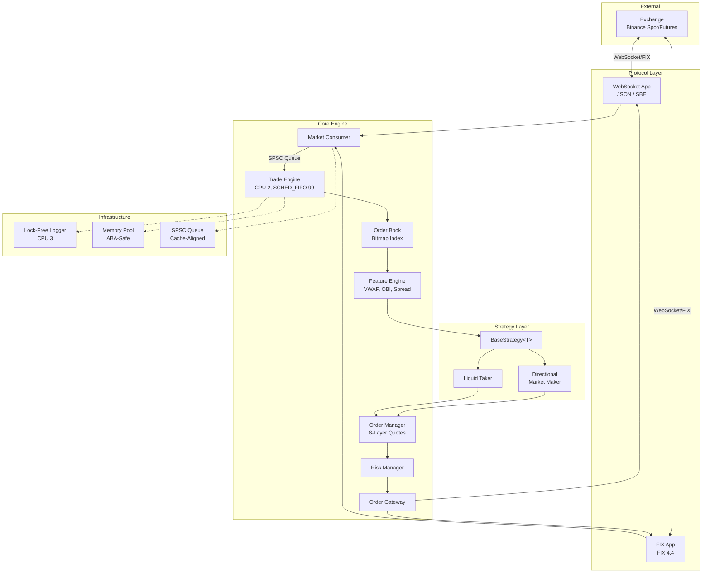

# HFT Trading Engine

Low-latency trading engine for cryptocurrency markets. Optimized for Binance Futures with WebSocket connectivity.

## Table of Contents

- [Features](#features)
- [Supported Exchanges](#supported-exchanges)
- [Architecture](#architecture)
- [Tech Stack](#tech-stack)
- [Code Structure](#code-structure)
- [Prerequisite](#prerequisite)
- [Configuration](#configuration)
- [Strategy System](#strategy-system)
- [Core Components](#core-components)
- [Logging](#logging)
- [Running](#running)
- [Development](#development)
- [Testing](#testing)

## Features

- **Zero-copy market data decoding**: Onepass SBE-style decoder without JSON parsing overhead
- **Lock-free architecture**: SPSC queues, thread-per-core design with CPU isolation
- **Fixed-point arithmetic**: Configurable price/quantity precision per symbol
- **RDTSC-based latency measurement**: Sub-microsecond profiling support

## Supported Exchanges

| Exchange | Market Data | Order Entry | Status |
|----------|-------------|-------------|--------|
| Binance Futures | WebSocket | WebSocket | Supported |
| Binance Spot | WebSocket, FIX | WebSocket, FIX | Supported |

> **Note**: Protocol implementations are based on Binance's official API specifications.

## Architecture



## Tech Stack

| Category | Technology |
|----------|------------|
| Language | C++23 |
| Build | CMake 3.28+, Ninja |
| Compiler | Clang 18+ (recommended), GCC 13+, **macOS: Homebrew LLVM required** |
| WebSocket | libwebsockets 4.4.0 |
| JSON | Glaze (compile-time reflection) |
| FIX Protocol | fix8 |
| Concurrency | moodycamel::ConcurrentQueue, TBB |
| Crypto | OpenSSL |
| Testing | GoogleTest, GoogleMock |

## Code Structure

```
hft/
├── common/          # Logger, INI config, FixedPoint, TSC clock, Auth, CPU isolation
├── core/            # Transport (WebSocket/FIX/SSL), Market Data, Order Entry schemas
│   ├── fix/         # FIX 4.4 protocol (NewOroFix44 schema)
│   └── websocket/   # WebSocket transport, SBE/JSON decoders
└── src/             # Trading components (mostly header-only templates - .hpp)
    ├── order_book.hpp
    ├── trade_engine.hpp
    ├── order_gateway.hpp
    ├── feature_engine.hpp
    ├── order_manager.hpp
    └── strategy/    # Strategy implementations (one folder per strategy)
```

# Prerequisite

## System Dependencies

### Linux
Install required system packages:
```bash
sudo apt install -y libtbb-dev libcurl4-openssl-dev cmake ninja-build clang-18
```

Set clang as the default compiler:
```bash
sudo update-alternatives --install /usr/bin/cc cc /usr/bin/clang-18 100
sudo update-alternatives --install /usr/bin/c++ c++ /usr/bin/clang++-18 100
sudo update-alternatives --config cc
sudo update-alternatives --config c++
```

### macOS
**Homebrew LLVM is required** - Apple Clang does not support `std::from_chars` for floating-point types.

```bash
brew install llvm ninja cmake
```

CMake will automatically detect and use Homebrew LLVM at `/opt/homebrew/opt/llvm`.

## Build

Configure and build:
```bash
cmake -DCMAKE_BUILD_TYPE=Release \
      -DCMAKE_C_COMPILER=/usr/bin/clang-18 \
      -DCMAKE_CXX_COMPILER=/usr/bin/clang++-18 \
      -DENABLE_WEBSOCKET=ON \
      -G Ninja \
      -S . -B build

ninja -C build HFTMain
```

### Build Options

| Option | Default | Description |
|--------|---------|-------------|
| `ENABLE_WEBSOCKET` | ON | Enable WebSocket transport (fetches libwebsockets 4.4.0) |
| `USE_FUTURES_API` | ON | Use Binance Futures API. Set to OFF for Spot trading |
| `ENABLE_ASAN` | OFF | Enable AddressSanitizer for memory error detection |
| `MEASUREMENT` | OFF | Enable RDTSC-based latency measurement macros |
| `FIXED_POINT_SYMBOL` | XRPUSDC | Target symbol for fixed-point precision config |

### Adding a New Symbol

To add a new trading pair:

1. Create symbol config file `resources/symbol/config-{SYMBOL}.ini`:
```ini
[meta]
ticker = NEWUSDC
ticker_size = 0.0001
qty_precision = 1
price_precision = 4
level = 1000
```

2. Add fixed-point configuration in `hft/common/fixed_point_config.hpp`:
```cpp
#ifdef FIXED_POINT_SYMBOL_NEWUSDC
  static constexpr int64_t kPriceScale = 10000;   // 4 decimals
  static constexpr int64_t kQtyScale = 10;        // 1 decimal
#endif
```

3. Update `CMakeLists.txt` to handle the new symbol:
```cmake
elseif (FIXED_POINT_SYMBOL STREQUAL "NEWUSDC")
    add_compile_definitions(FIXED_POINT_SYMBOL_NEWUSDC)
    message(STATUS "FixedPoint: NEWUSDC (price=4, qty=1)")
```

4. Update strategy parameters if scaling is needed (see [Strategy Parameters](#strategy-parameters))

5. Build with the new symbol:
```bash
cmake -DFIXED_POINT_SYMBOL=NEWUSDC ...
```

Example with all options:
```bash
cmake -DCMAKE_BUILD_TYPE=Release \
      -DENABLE_WEBSOCKET=ON \
      -DUSE_FUTURES_API=ON \
      -G Ninja \
      -S . -B build
```

## Configuration

Configuration uses a profile-based system. The main `config.ini` selects profiles that are loaded and merged in order (later profiles override earlier ones):
1. `environment` → `resources/env/config-{name}.ini`
2. Custom profiles (alphabetically sorted)
3. `symbol` → `resources/symbol/config-{name}.ini`
4. `strategy` → `resources/strategy/config-{name}.ini`

Directory structure:

```
resources/
├── config.ini                      # Main config (profile selection)
├── auth/
│   ├── config-auth.ini.template    # Template for API credentials
│   └── config-auth.ini             # Your API credentials (gitignored)
├── env/
│   ├── config-dev.ini              # Development/testnet settings
│   └── config-prod.ini             # Production settings
├── symbol/
│   ├── config-XRPUSDC.ini          # XRPUSDC symbol settings
│   ├── config-BTCUSDC.ini          # BTCUSDC symbol settings
│   └── config-BTCUSDT.ini          # BTCUSDT symbol settings
└── strategy/
    └── config-*.ini                # Strategy-specific settings
```

**Quick setup:**
```bash
# 1. Copy auth template
cp resources/auth/config-auth.ini.template resources/auth/config-auth.ini

# 2. Edit with your API credentials
vim resources/auth/config-auth.ini

# 3. Edit main config to select profile
vim resources/config.ini
```

**Main config.ini format:**
```ini
[profile]
auth = auth              # loads resources/auth/config-auth.ini
environment = prod       # loads resources/env/config-prod.ini
symbol = XRPUSDC         # loads resources/symbol/config-XRPUSDC.ini
strategy = directional_strategy  # loads resources/strategy/config-directional_strategy.ini
```

## Strategy System

Strategies are compile-time selected via CMake target. Available strategy targets:
- `HFT_maker`: ObiVwapDirectionalStrategy (market maker)
- `HFT_taker`: LiquidTaker (liquidity taker)
- `HFTMain`: Default (ObiVwapDirectionalStrategy)

To add a new strategy:
1. Create strategy class in `hft/src/strategy/your_strategy/`
2. Inherit from `BaseStrategy<YourStrategy>` (CRTP pattern)
3. Implement required methods:
   - `on_orderbook_updated()`
   - `on_trade_updated()`
   - `on_order_response()`
4. Add CMake target in root `CMakeLists.txt`:
```cmake
add_strategy_target(HFT_your_strategy "trading::YourStrategy" "YourStrategy")
```

### Strategy Parameters (ObiVwapDirectionalStrategy)

| Parameter | Type | Description |
|-----------|------|-------------|
| `obi_level` | int | Order book depth for imbalance calculation (must be power of 2) |
| `safety_margin` | double | Price offset from BBO for order placement (in price units) |
| `minimum_spread` | int64 | Minimum spread threshold for signal calculation (raw price) |
| `enter_threshold` | int64 | Signal threshold to open new position |
| `exit_threshold` | int64 | Signal threshold to close existing position |
| `position_variance` | int64 | Divisor for position sizing based on signal strength |

> **Note on Scaling**: Parameters can be stored as raw values or scaled in the strategy constructor. For example, `safety_margin` is scaled by `kPriceScale` in the constructor:
> ```cpp
> safety_margin_(static_cast<int64_t>(
>     INI_CONFIG.get_double("strategy", "safety_margin") *
>     common::FixedPointConfig::kPriceScale))
> ```
> When adding a new symbol, check if strategy parameters need adjustment for the new price/qty precision.

## Core Components

| Component | Description |
|-----------|-------------|
| **TradeEngine** | Central orchestrator running on dedicated CPU with `SCHED_FIFO` priority 99. Receives market data via SPSC queue, updates order book, and dispatches to strategy. |
| **MarketConsumer** | Receives market data from transport layer and forwards to TradeEngine. Handles snapshot requests and ensures market data completeness. |
| **OrderBook** | Bitmap-indexed order book with O(1) best bid/ask lookup. Supports configurable depth levels and fixed-point price/quantity. |
| **FeatureEngine** | Computes common trading signals shared across strategies: VWAP, Order Book Imbalance (OBI), spread, mid-price. All calculations use fixed-point arithmetic. |
| **OrderGateway** | Receives orders from TradeEngine and forwards to transport layer. Routes execution reports from transport back to TradeEngine. |
| **OrderManager** | Maintains up to 8 quote layers per side. Handles order state transitions and replace logic with configurable TTL. |
| **PositionKeeper** | Tracks current P&L and position per ticker. Supports both long/short positions for futures. |
| **RiskManager** | Pre-trade risk checks: max order size, max/min position limits, max loss threshold. |
| **InventoryManager** | Inventory-based quote skewing. Applies penalty to quotes based on position deviation from target. Based on Avellaneda-Stoikov market making model. |

> **Note**: Strategy-specific configurations should be placed in separate folders under `hft/src/strategy/`. See `CMakeLists.txt` for how strategy targets are defined.

## config.ini Example

Full configuration field reference (merged from all profile files):

### [auth] - API Credentials
```ini
[auth]
api_key = {API_KEY}
pem_file_path = resources/private.pem
private_password = {PRIVATE_PEM_FILE_PASSWORD}
```

### [exchange] - Exchange Connection
```ini
[exchange]
md_api_host = testnet.binancefuture.com    # Market data endpoint
oe_api_host = testnet.binancefuture.com    # Order entry endpoint
md_port = 443
oe_port = 443
md_use_ssl = 1
oe_use_ssl = 1
```

### [meta] - Symbol Configuration
```ini
[meta]
ticker = XRPUSDC          # Trading pair
ticker_size = 0.0001      # Minimum price increment
qty_precision = 1         # Quantity decimal places
price_precision = 4       # Price decimal places
level = 1000              # Order book depth levels
```

### [risk] - Risk Manager Settings
```ini
[risk]
max_order_size = 100      # Maximum single order quantity
max_position = 5000       # Maximum long position
min_position = -5000      # Maximum short position (negative)
max_loss = -30            # Stop trading if P&L drops below this (in quote currency)
```

### [inventory] - Inventory Manager Settings
```ini
[inventory]
skew_coefficient = 0.001  # Quote adjustment factor per unit position deviation
target_position = 0.0     # Target inventory level
```

### [orders] - Order Manager Settings
```ini
[orders]
min_replace_qty_delta = 1e-5      # Minimum qty change to trigger replace
min_replace_tick_delta = 50       # Minimum tick change to trigger replace
ttl_reserved_ns = 6,000,000,000   # Time before reserved order expires (6s)
ttl_live_ns = 3,500,000,000       # Time before live order refresh (3.5s)
```

### [cpu_id] / [thread_*] - CPU Affinity & Scheduling
```ini
[cpu_id]
use_cpu_group = 1         # Enable CPU group isolation
use_cpu_to_tid = 1        # Enable thread-to-CPU pinning
count = 5                 # Number of CPUs to manage

[thread_0]
name = MDWrite            # Thread name (must match pthread_setname_np)
cpu_id = 0                # CPU core to pin
prio = 40                 # Scheduler priority (1-99 for FIFO/RR)
nicev = -10               # Nice value (-20 to 19)

[thread_3]
name = TradeEngine
cpu_id = 2
prio = 99                 # Highest priority for TradeEngine
nicev = -20
```

### [main_init] - Memory Pool Sizes
```ini
[main_init]
mud_pool_size = 2048           # MarketUpdateData pool size
md_pool_size = 65536           # MarketData pool size
response_memory_size = 1024    # ExecutionReport pool size
```

## Logging

The logger uses a lock-free MPSC queue with multiple sink support.

### Configuration

```ini
[log]
level = DEBUG    # TRACE, DEBUG, INFO, WARN, ERROR, FATAL
size = 10245760  # Max log file size in bytes
```

### Sinks

Configured in `main.cpp`:
```cpp
logger->clearSink();
logger->addSink(std::make_unique<common::ConsoleSink>());
logger->addSink(std::make_unique<common::FileSink>("log", size));
```

- **ConsoleSink**: Outputs to stdout
- **FileSink**: Rotating file logs in `log/` directory

### Log Levels

| Level | Description |
|-------|-------------|
| TRACE | Detailed debugging (high volume) |
| DEBUG | Development debugging |
| INFO | Operational messages |
| WARN | Potential issues |
| ERROR | Recoverable errors |
| FATAL | Critical failures |

## Benchmark Results

TBD - [Performance Analysis (Notion)](https://notion.so/...)

# Running

## Set systemd for cgroup (Recommended)

For detailed instructions on setting up the HFT engine as a systemd service with CPU isolation, see [util/README.md](util/README.md).

Quick setup:
1. Configure iso.slice for CPU isolation
2. Install the HFT service using provided service file
3. CPU isolation is managed automatically on service start/stop

See [util/README.md](util/README.md) for complete documentation.

## Linux Account Setting (Optional)

> **Note**: Skip this section if running via systemd service (iso.slice). Systemd services run as root and can set CPU scheduling directly via service file options (`CPUSchedulingPolicy=fifo`, `CPUSchedulingPriority=99`, `Nice=-20`).

Only required when running directly as a user account. To allow changing cpu scheduler policy and nice values, configure PAM limits:

```shell
# 1. Check pam_limits.so is loaded
grep -n 'pam_limits.so' /etc/pam.d/common-session /etc/pam.d/sshd

# 2. Add limit allowance
echo "$USER - rtprio 99" | sudo tee /etc/security/limits.d/99-rtprio.conf
echo "$USER - nice -20" | sudo tee /etc/security/limits.d/99-nice.conf

# 3. Re-login and verify
ulimit -r  # should show 99
ulimit -e  # should show 40
```

## Health Checker with supervisord

1. Install supervisord
```bash
sudo apt install supervisor
```

2. Register service
```bash
# Add slack webhook in supervisord
Environment=SLACK_WEBHOOK_URL=https://hooks.slack.com/services/XXX/YYY/ZZZ

# Copy execute file
sudo ln -s ${YOUR_PROJECT_BUILD_PATH}/HFTMain /opt/supervisor/

# Copy slack notifier file
sudo ln -s ${YOUR_PROJECT_PATH}/util/slack_notifier.py /opt/supervisor/listeners/

# Register supervisord files
sudo ln -s ${YOUR_PROJECT_PATH}/util/hft-supervisord.conf /etc/supervisor/conf.d/
sudo ln -s ${YOUR_PROJECT_PATH}/util/slack_notifier.conf /etc/supervisor/conf.d/

# Init supervisorctl and check its status
sudo supervisorctl reread
sudo supervisorctl update
sudo supervisorctl status

# Stop hft
sudo supervisorctl stop hft
```

# Development

## FIX8 Schema Compilation

To compile FIX protocol schemas using fix8, navigate to the schema directory and run:

```bash
cd hft/core/fix/NewOroFix44

# Compile Market Data schema
f8c -p NewOroFix44MD -n NewOroFix44MD -o . fix-md.xml

# Compile Order Entry schema
f8c -p NewOroFix44OE -n NewOroFix44OE -o . fix-oe.xml
```

This generates the necessary C++ source files (*_types.hpp, *_types.cpp, *_traits.cpp, *_router.hpp, *_classes.hpp, *_classes.cpp) for FIX protocol handling.

## INI Checker

Run ini_checker to verify config.ini matches all code that uses INI configuration values:
```bash
python3 ini_checker.py --ini resources/config.ini --root hft
```

# Testing

## ASAN Test
```bash
cmake -S . -B test-build -DENABLE_ASAN=ON
cmake --build test-build -j
ASAN_OPTIONS=allocator_may_return_null=0:detect_leaks=1 ctest --test-dir test-build/test -V
```

## Testing Notes

When writing tests that use `Logger`, declare the Logger instance globally or as a static fixture member to avoid thread-local storage issues with ProducerTokens. Logger uses thread_local storage for performance optimization, so creating and destroying Logger instances within individual test scopes can cause use-after-free issues.

**Important**: Static member variables must be defined outside the class declaration to avoid linker errors (`undefined reference`).

Example:
```cpp
class NeworoTest : public ::testing::Test {
 protected:
  static std::unique_ptr<Logger> logger;
  void SetUp() override {
    logger = std::make_unique<Logger>();
  }
};

// Static member definition (required!)
std::unique_ptr<Logger> NeworoTest::logger;
```

## Performance Benchmark Tests

### Enabling Latency Measurement

To measure latency, enable the `MEASUREMENT` compile definition:

```bash
cmake -DCMAKE_BUILD_TYPE=RelWithDebInfo \
      -DENABLE_WEBSOCKET=ON \
      -DMEASUREMENT=ON \
      -G Ninja \
      -S . -B build-bench
```

This enables RDTSC-based macros in `hft/common/performance.h`:
```cpp
START_MEASURE(TAG);
// ... code to measure ...
END_MEASURE(TAG, logger);  // outputs "[RDTSC]: TAG: <cycles>"
```

### Strategy-Specific Benchmark Targets

| Target | Strategy |
|--------|----------|
| `full_pipeline_benchmark_directional_tests` | ObiVwapDirectionalStrategy |
| `full_pipeline_benchmark_mean_reversion_tests` | MeanReversionMakerStrategy |
| `full_pipeline_benchmark_liquid_taker_tests` | LiquidTaker |

Build example:
```bash
cmake --build build --target full_pipeline_benchmark_mean_reversion_tests
```

**A/B Testing Note**: Ensure the config file matches the strategy being tested. The benchmark loads config from `test/resources/`. Update `full_pipeline_benchmark_tests.cpp` if needed:
```cpp
INI_CONFIG.load("resources/config-xrpusdc.ini");  // Verify this matches your strategy
```

### Running Benchmarks

Run benchmarks in CPU-isolated environment for accurate results:
```bash
sudo systemd-run --scope --slice=iso.slice -p AllowedCPUs=1-5 ./full_pipeline_benchmark_mean_reversion_tests
```

### Analyzing Results

Use `util/analyze_rdtsc.py` to parse RDTSC logs:
```bash
python3 util/analyze_rdtsc.py benchmark_*.log
python3 util/analyze_rdtsc.py --markdown -o result.md benchmark_*.log
```

See `docs/benchmark-guide.md` for detailed workflow and visualization tools.

### A/B Comparison Tests

To compare different implementations (e.g., orderbook variants), create separate benchmark targets in `test/CMakeLists.txt`:

```cmake
# Example: Comparing two orderbook implementations
set(VARIANT_A_TARGET benchmark_my_test_variant_a)
add_executable(${VARIANT_A_TARGET} my_benchmark_tests.cpp)
target_compile_definitions(${VARIANT_A_TARGET} PRIVATE ENABLE_WEBSOCKET USE_VARIANT_A)
target_link_libraries(${VARIANT_A_TARGET} PRIVATE
        HftLib_variant_a
        GTest::gtest_main
        GTest::gmock
        cap
)
target_precompile_headers(${VARIANT_A_TARGET} PRIVATE ${CMAKE_SOURCE_DIR}/include/pch.h)
target_include_directories(${VARIANT_A_TARGET} PRIVATE ${TEST_STRATEGY_INCLUDE_DIR})

set(VARIANT_B_TARGET benchmark_my_test_variant_b)
add_executable(${VARIANT_B_TARGET} my_benchmark_tests.cpp)
target_compile_definitions(${VARIANT_B_TARGET} PRIVATE ENABLE_WEBSOCKET USE_VARIANT_B)
target_link_libraries(${VARIANT_B_TARGET} PRIVATE
        HftLib_variant_b
        GTest::gtest_main
        GTest::gmock
        cap
)
target_precompile_headers(${VARIANT_B_TARGET} PRIVATE ${CMAKE_SOURCE_DIR}/include/pch.h)
target_include_directories(${VARIANT_B_TARGET} PRIVATE ${TEST_STRATEGY_INCLUDE_DIR})
```

Key points:
- Use `target_compile_definitions` to switch implementations via preprocessor macros
- Link different library variants (e.g., `HftLib_ws_flat` vs `HftLib_ws`)
- Same source file can produce multiple binaries for A/B comparison

## CPU Monitoring

Check which processes are running on each CPU core:
```bash
ps -eo pid,comm,psr --no-headers | sort -k3 -n | awk '{cpu[$3] = cpu[$3] $1 " " $2 "\n"} END {for (c in cpu) {print "=== CPU " c " ==="; print cpu[c]}}'
```

Check current CPU isolation status:
```bash
# Check iso.slice allowed CPUs
systemctl show iso.slice | grep AllowedCPUs

# Check kernel boot parameters for CPU isolation
cat /proc/cmdline | tr ' ' '\n' | grep -E "isolcpus|nohz_full|rcu_nocbs"

# Check isolated CPUs (kernel level)
cat /sys/devices/system/cpu/isolated
```

Check CPU usage per core:
```bash
mpstat -P ALL 1 3
```
