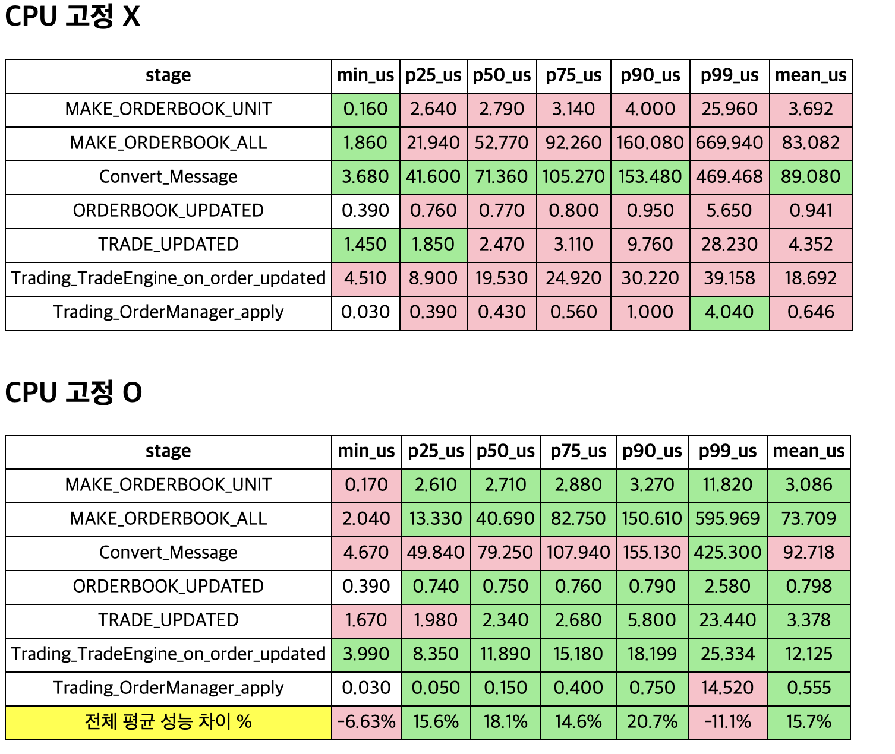

- 기술 스택: C++
- 참여 인원: 2명
- 개발 기간: 2025.07~2025.09
- 깃헙주소 :  https://github.com/RichTraders/hft/
- 구조도


## **1. 핵심 아키텍처 설계 및 구현**

**1) 멀티스레드 실시간 트레이딩 엔진 개발**

- **7개 스레드 + 5개 CPU 코어 격리** 아키텍처 설계

    ```
    - FIX MarketData Read/Write 스레드 (CPU 0):  Market Data I/O
    - FIX Order Entry Read/Write 스레드 (CPU 1): FIX Order Entry I/O
    - 마켓 데이터 수신 스레드 (CPU 2, priority 99): 시장 데이터 처리
    - 주문 응답 처리 스레드 (CPU 3, priority 99): 주문 응답 처리
    - Logger 스레드 (CPU 4): 비동기 로깅
    ```

- CPU affinity 및 실시간 우선순위 스케줄링 (SCHED_FIFO priority 99)
- Lock-free SPSC 큐 기반 스레드 간 통신 (zero-copy 메시지 전달)

**2) FIX 프로토콜 TCP/SSL 통신 모듈 구현**

- Binance FIX 프로토콜 구현 (Market Data + Order Entry)
- OpenSSL 기반 TLS 1.2+ 암호화 통신
- RSA 서명 기반 인증 시스템

**구현 내용:**

- FIX Logon, Logout, Heartbeat, InstrumentList, Snapshot, Incremental Update 처리
- NewSingleOrder, CancelRequest, CancelReplaceRequest 주문 메시지 생성
- ExecutionReport, OrderCancelReject 응답 파싱

**3) 초저지연 오더북 자료구조 설계**

- 2단계 비트맵 인덱싱 구조로 O(1)~O(log n) 가격 레벨 조회
    - BSR, BSF 비트 연산 적극 사용
- 가격 범위 $1000~$300,000을 730개 버킷으로 분할 (버킷당 4096 가격 레벨)
- 64비트 비트맵 + 요약 비트맵으로 활성 레벨 추적
- CPU 캐시 최적화 (64바이트 정렬, 버킷당 ~64KB)

## **2. 주문 관리 시스템 (OMS)**

**1) 주문 생명주기 관리 시스템**

- **8-layer 주문 슬롯 관리** (bid/ask 각 8레이어)
- 상태 머신: `INVALID → PENDING_NEW → LIVE → PENDING_CANCEL → DEAD`
- Quote Reconciliation: 전략은 의도만 전달. 판단은 OrderManager에서.
    - 주문 교체 시 원본-신규 ID 매핑 추적
- TTL 기반 주문 만료 관리 (min-heap priority queue)

**주문 교체 최적화:**

- 수량/가격 delta 검증으로 불필요한 교체 방지
- 미확인 주문 슬롯 예약 시스템

**2) 실시간 리스크 관리 시스템**

- Pre-trade 리스크 체크 (주문 제출 전 검증)
- 포지션 한도 관리 (max/min position)
- 주문 크기 제한 (max order size)
- 손실 한도 관리 (max loss %)
- Pending 주문 예약 포지션 추적

**3) 포지션 및 손익 추적 시스템**

- 실시간 포지션 수량 추적
- 실현 손익 (Realized P&L) 계산
- 미실현 손익 (Unrealized P&L) 계산 (BBO 기준 mark-to-market)
- VWAP 기반 평균 진입가 관리

### **3. 성능 최적화 및 시스템 튜닝**

**1) 나노초 단위 타이밍 시스템**

- **RDTSC (CPU Timestamp Counter)** 기반 정밀 시간 측정
- CPU 클럭 주기적 재보정 (drift 방지)
- Acquire/Release 메모리 순서 보장

**2) 메모리 풀 및 Zero Copy 아키텍처**

- 사전 할당 메모리 풀로 runtime heap 할당 제거
- Lock-free SPSC 큐로 스레드 간 메시지 전달
- 64바이트 캐시라인 패딩으로 False Sharing 방지

### **4. 프로덕션 레벨**

**운영 인프라:**

- Supervisord 헬스체크 + Slack 알림
- INI 기반 설정 관리
- 비동기 로깅 + 로그 로테이션
- ASAN 메모리 누수 검증

**코드 품질:**

- 모던 C++20 (concepts, constexpr, requires clauses)
- 종합 단위 테스트
- 문서화 (README, 설정 가이드)
- Clang-tidy, clang-format 적용, git hook 강제화.

### CPU affinity 적용 여부에 따른 내부 성능 테스트 결과



- 테스트 환경: AMD 5500GT (6cores 12 threads). 32G DDR4 memory
- 테스트 데이터: 각 환경별 FIX data 12시간
- 테스트 방법: RDTSC로 각 주요 구간별 걸린 사이클 측정, CPU clock수를 통해 걸린 시각 추산.
- 테스트 결과:  CPU affinity 사용시 10%이상 빠른 처리 확인 ✅