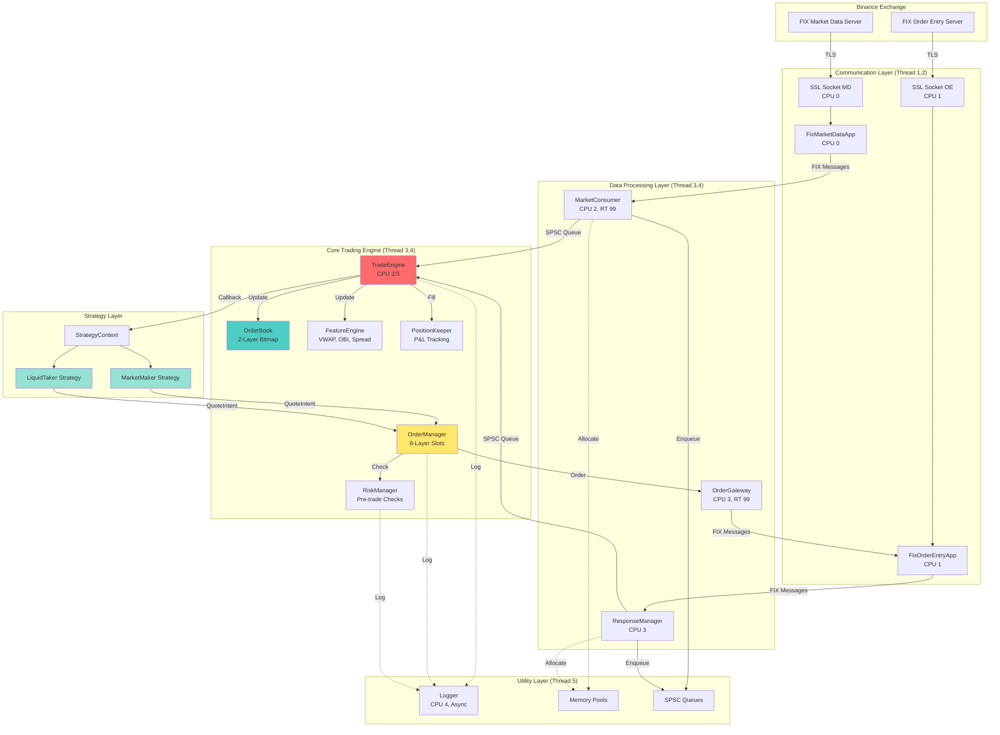
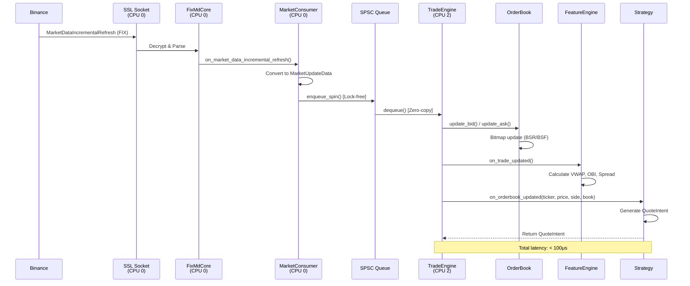
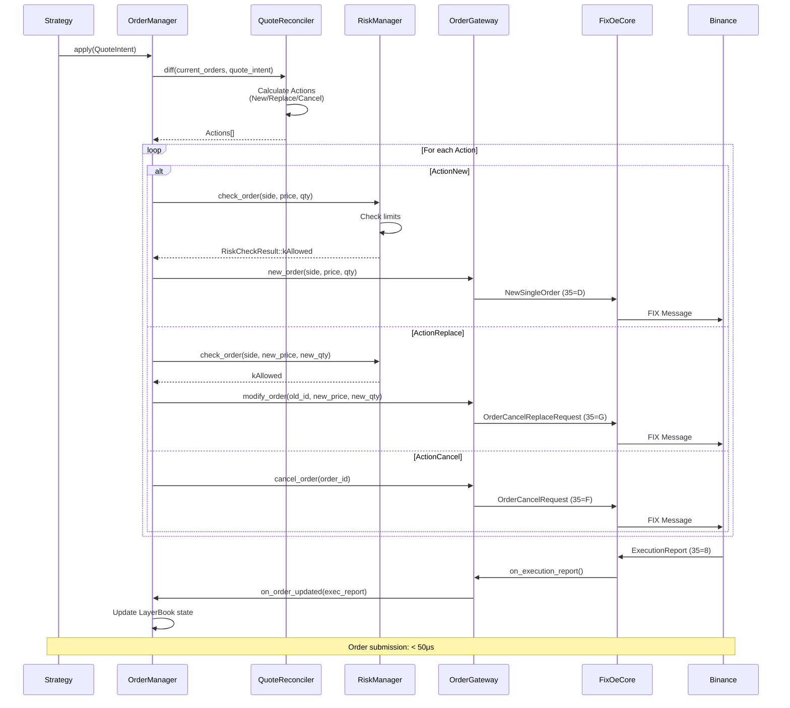
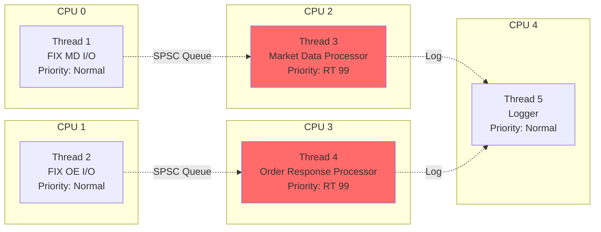
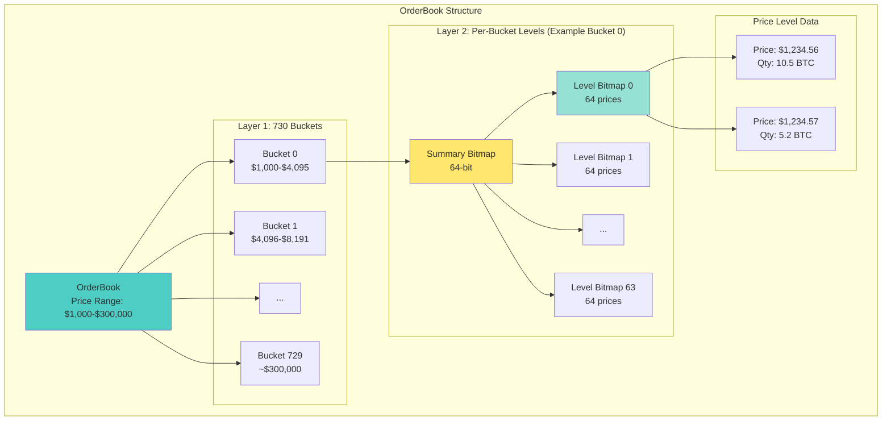
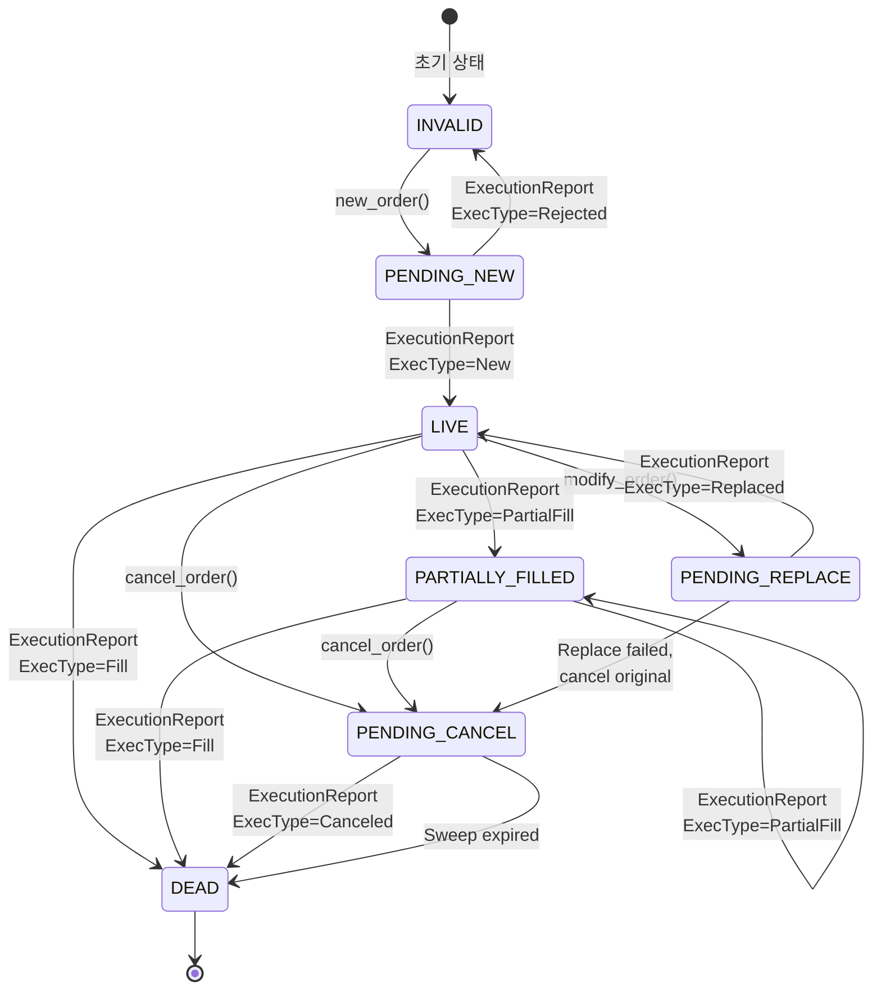

# HFT 시스템 요구사항 명세서

## 문서 정보
- **프로젝트명**: HFT (High-Frequency Trading) System
- **버전**: 1.0
- **작성일**: 2025-11-05
- **기술 스택**: C++20
- **개발 기간**: 2025.07 ~ 2025.09
- **참여 인원**: 2명
- **저장소**: https://github.com/RichTraders/hft/

---

## 1. 프로젝트 개요

### 1.1 프로젝트 목적
초저지연(Ultra-Low Latency) 암호화폐 고빈도 거래 시스템으로, Binance 거래소와 FIX 프로토콜을 통해 연결하여 마이크로초 단위의 빠른 주문 실행을 목표로 합니다.

### 1.2 핵심 목표
- **성능**: 나노초 단위 타이밍, 마이크로초 단위 주문 실행
- **안정성**: 24/7 무정지 운영, 완벽한 주문 생명주기 관리
- **확장성**: 멀티 전략 지원, 동적 전략 로딩
- **보안**: RSA 서명 기반 인증, TLS 1.2+ 암호화 통신

### 1.3 주요 성과
- **CPU Affinity 적용 시 10%+ 성능 향상** 달성
- **실시간 우선순위 스케줄링** (SCHED_FIFO priority 99)
- **Lock-free 아키텍처**로 스레드 경합 제거
- **Zero-copy 메시지 전달**로 메모리 오버헤드 최소화

---

## 2. 시스템 아키텍처

### 2.1 전체 아키텍처 개요

본 시스템은 **멀티스레드 기반 이벤트 주도형(Event-Driven) 아키텍처**를 채택하였으며, 6개의 전용 스레드가 4개의 격리된 CPU 코어에서 동작합니다.

#### 스레드 및 CPU 코어 할당

| 스레드 | CPU 코어 | 우선순위 | 역할 |
|--------|----------|----------|------|
| FIX MarketData I/O READ | CPU 0 | RT 60 | Market Data 읽기 |
| FIX MarketData I/O WRITE| CPU 0 | RT 40 | Market Data 쓰기 |
| FIX Order Entry I/O READ | CPU 1 | RT 50 | Order Entry 읽기 |
| FIX Order Entry I/O WRITE| CPU 1 | RT 50 | Order Entry 쓰기 |
| Trade Engine Processor | CPU 2 | RT 99 | 시장 데이터 실시간 처리, 주문 응답 실시간 처리 |
| Logger | CPU 3 | 기본 | 비동기 로깅 |
| main | CPU 할당 X | 기본 | Composite Root pattern |

**RT**: Real-Time (SCHED_FIFO 스케줄링)

### 2.2 핵심 설계 원칙

1. **CPU 격리**: 커널 인터럽트로부터 트레이딩 코어 격리
2. **Lock-free 통신**: SPSC 큐로 스레드 간 무잠금 통신
3. **Zero-copy 전달**: 메모리 풀 기반 객체 재사용
4. **캐시라인 정렬**: 64바이트 정렬로 False Sharing 방지
5. **사전 할당**: 런타임 힙 할당 완전 제거
ㅜ
### 2.3 메모리 아키텍처

- **메모리 풀**: 모든 메시지 타입(MarketData, ExecutionReport 등) 사전 할당
- **SPSC 큐**: 링 버퍼 기반 단일 생산자-소비자 큐
- **64바이트 패딩**: 각 중요 자료구조에 캐시라인 패딩 적용

---

## 3. 기능 요구사항

| 요구사항 ID | 모듈 | 기능명 | 우선순위 | 설명 | 세부 기능 |
|-------------|------|--------|----------|------|-----------|
| **FR-MD-001** | MarketConsumer | FIX Market Data 연결 관리 | 필수 | Binance FIX Market Data 서버와 TLS 연결 수립 및 유지 | - TLS 1.2+ 암호화 연결<br>- RSA 서명 기반 인증<br>- Heartbeat 자동 응답 (30초 간격)<br>- 연결 끊김 시 자동 재연결 |
| **FR-MD-002** | MarketConsumer | 시장 데이터 수신 | 필수 | 오더북 스냅샷 및 증분 업데이트 수신 | - Logon 후 InstrumentList 수신<br>- MarketDataRequest로 구독 시작<br>- 초기 Snapshot 수신 및 적용<br>- 증분 업데이트 스트리밍 처리<br>- 체결 데이터 실시간 수신 |
| **FR-MD-003** | MarketConsumer | 메시지 파싱 및 변환 | 필수 | FIX 메시지를 내부 자료구조로 변환 | - FIX44::MarketDataSnapshotFullRefresh 파싱<br>- FIX44::MarketDataIncrementalRefresh 파싱<br>- 가격/수량 문자열→숫자형 변환<br>- 타임스탬프 파싱 (나노초 정밀도) |
| **FR-OB-001** | OrderBook | 2단계 비트맵 인덱싱 | 필수 | 초저지연 가격 레벨 조회를 위한 비트맵 기반 자료구조 | - 가격 범위 $1,000~$300,000 지원<br>- 730개 버킷 분할 (버킷당 4096 레벨)<br>- 64비트 비트맵으로 활성 레벨 추적<br>- BSR/BSF 비트 스캔 명령어 활용 |
| **FR-OB-002** | OrderBook | 가격 레벨 업데이트 | 필수 | 실시간 호가 업데이트 처리 | - `update_bid(price, qty)`: 매수 호가 업데이트<br>- `update_ask(price, qty)`: 매도 호가 업데이트<br>- 수량 0인 경우 레벨 삭제<br>- 비트맵 자동 업데이트 |
| **FR-OB-003** | OrderBook | 최우선 호가 조회 | 필수 | O(1) 시간 복잡도로 BBO 조회 | - `best_bid_price()`: 최고 매수 가격<br>- `best_ask_price()`: 최저 매도 가격<br>- `best_bid_qty()`: 최고 매수 수량<br>- `best_ask_qty()`: 최저 매도 수량 |
| **FR-OB-004** | OrderBook | 상위 N레벨 조회 | 필수 | 상위 N개 호가 레벨 효율적 조회 | - `peek_levels(side, depth)`: 지정 depth 호가 조회<br>- 비트맵 스캔으로 빠른 탐색 |
| **FR-OM-001** | OrderManager | 8-Layer 주문 슬롯 관리 | 필수 | 매수/매도 각 8개 슬롯으로 주문 관리 | - 슬롯 상태: `INVALID→PENDING_NEW→LIVE→PENDING_CANCEL→DEAD`<br>- 가격 레벨별 슬롯 할당<br>- LRU 기반 희생자 선택<br>- 슬롯 예약 시스템 |
| **FR-OM-002** | OrderManager | 주문 생명주기 관리 | 필수 | 주문의 전체 생명주기 추적 및 관리 | - `new_order()`: 신규 주문 제출<br>- `modify_order()`: 주문 정정<br>- `cancel_order()`: 주문 취소<br>- `on_order_updated()`: 체결 보고서 처리<br>- 원본-신규 주문 ID 매핑 추적 |
| **FR-OM-003** | OrderManager | Quote Reconciliation | 필수 | 전략 의도와 실제 주문 상태 조정 | - QuoteIntent 수신<br>- 현재 주문 상태와 diff 계산<br>- 필요한 액션 생성 (New/Replace/Cancel)<br>- Delta 검증<br>- VenuePolicy 적용 |
| **FR-OM-004** | OrderManager | TTL 기반 주문 만료 | 필수 | 오래된 주문 자동 취소 | - Min-heap priority queue로 만료 시간 추적<br>- `sweep_expired()`: 만료 주문 일괄 취소<br>- 설정 가능한 TTL |
| **FR-RM-001** | RiskManager | Pre-trade 리스크 체크 | 필수 | 주문 제출 전 리스크 검증 | - `check_order()`: 주문 검증<br>- 결과: `kAllowed`, `kOrderTooLarge`, `kPositionTooLarge`, `kPositionTooSmall`, `kLossTooLarge` |
| **FR-RM-002** | RiskManager | 주문 크기 제한 | 필수 | 단일 주문 최대 수량 제한 | - config.ini에서 `max_order_size` 설정<br>- 주문 수량 한도 초과 시 거부 |
| **FR-RM-003** | RiskManager | 포지션 한도 관리 | 필수 | 최대/최소 포지션 제한 | - `max_position`: 최대 롱 포지션<br>- `min_position`: 최대 숏 포지션<br>- Reserved 포지션 고려 |
| **FR-RM-004** | RiskManager | 손실 한도 관리 | 필수 | 최대 허용 손실률 모니터링 | - `max_loss_pct`: 최대 손실 비율 (%)<br>- 실시간 손익 추적<br>- 한도 초과 시 신규 주문 차단 |
| **FR-PK-001** | PositionKeeper | 실시간 포지션 추적 | 필수 | 체결 발생 시 포지션 즉시 업데이트 | - `add_fill(side, price, qty)`: 체결 추가<br>- 매수 체결: 포지션 증가<br>- 매도 체결: 포지션 감소<br>- Net position 계산 |
| **FR-PK-002** | PositionKeeper | 실현 손익 계산 | 필수 | 포지션 청산 시 실현 손익 계산 | - FIFO 방식<br>- 롱 청산: (매도가 - 평균 매수가) × 수량<br>- 숏 청산: (평균 매도가 - 매수가) × 수량<br>- 누적 실현 손익 추적 |
| **FR-PK-003** | PositionKeeper | 미실현 손익 계산 | 필수 | 현재 포지션의 평가 손익 | - `update_bbo(bid, ask)`: 최신 BBO 반영<br>- 롱 포지션: (현재가 - 평균 매수가) × 수량<br>- 숏 포지션: (평균 매도가 - 현재가) × 수량<br>- 실시간 업데이트 |
| **FR-PK-004** | PositionKeeper | VWAP 계산 | 필수 | 평균 진입가 추적 | - Volume-Weighted Average Price<br>- 포지션 진입 시 가중 평균 계산<br>- 포지션 청산 시 VWAP 재계산 |
| **FR-FE-001** | FeatureEngine | 시장 지표 계산 | 필수 | 전략에 필요한 시장 특징값 실시간 계산 | - Mid Price: (best_bid + best_ask) / 2<br>- Spread: best_ask - best_bid<br>- VWAP: 거래량 가중 평균<br>- Aggressive Trade Qty Ratio<br>- Order Book Imbalance (OBI) |
| **FR-FE-002** | FeatureEngine | 롤링 윈도우 통계 | 권장 | 시간 기반 슬라이딩 윈도우 통계 | - VWAP 윈도우 크기 설정<br>- 오래된 데이터 자동 제거<br>- 효율적인 증분 업데이트 |
| **FR-OG-001** | OrderGateway | FIX Order Entry 연결 | 필수 | Binance FIX Order Entry 서버 연결 관리 | - TLS 연결 수립<br>- RSA 서명 인증<br>- Heartbeat 관리<br>- 자동 재연결 |
| **FR-OG-002** | OrderGateway | 주문 메시지 변환 | 필수 | 내부 주문 요청을 FIX 메시지로 변환 | - NewSingleOrder (35=D)<br>- OrderCancelRequest (35=F)<br>- OrderCancelReplaceRequest (35=G)<br>- OrderMassCancelRequest (35=q) |
| **FR-OG-003** | OrderGateway | 체결 보고서 파싱 | 필수 | FIX ExecutionReport 파싱 및 변환 | - ExecutionReport (35=8) 파싱<br>- ExecType 분류<br>- 누적 체결 수량 추적<br>- 남은 수량 계산 |
| **FR-ST-001** | Strategy | 동적 전략 로딩 | 필수 | config.ini에서 전략 선택 및 동적 로딩 | - 전략 등록 시스템 (Registrar 패턴)<br>- VTable 기반 다형성<br>- 런타임 전략 선택<br>- 전략별 파라미터 설정 |
| **FR-ST-002** | Strategy | 전략 콜백 인터페이스 | 필수 | 전략이 구현해야 할 콜백 함수 | - `on_orderbook_updated()`: 오더북 변경 시<br>- `on_trade_updated()`: 체결 발생 시<br>- `on_order_updated()`: 주문 상태 변경 시 |
| **FR-ST-003** | Strategy | Quote Intent 생성 | 필수 | 전략이 원하는 호가를 QuoteIntent로 표현 | - 매수/매도 각 8개 슬롯<br>- 가격, 수량, 활성화 여부<br>- OrderManager에 전달 |
| **FR-ST-004** | Strategy | MarketMaker 전략 | 필수 | 유동성 제공 전략 | - 스프레드 계산<br>- 매수/매도 호가 생성<br>- Order Book Imbalance 고려<br>- VWAP 기반 가격 조정 |
| **FR-ST-005** | Strategy | LiquidTaker 전략 | 권장 | 유동성 소비 전략 | - 시장가 주문 생성<br>- 체결 가능한 호가 공격<br>- 슬리피지 관리 |
| **FR-LG-001** | Logger | 비동기 로깅 | 필수 | 메인 스레드를 블로킹하지 않는 로깅 | - Lock-free MPSC 큐<br>- 전용 로거 스레드 (CPU 3)<br>- Thread-local ProducerToken 최적화<br>- 나노초 정밀도 타임스탬프 |
| **FR-LG-002** | Logger | 로그 레벨 | 필수 | 중요도별 로그 필터링 | - TRACE, DEBUG, INFO, WARN, ERROR, FATAL |
| **FR-LG-003** | Logger | 로그 출력 | 필수 | 다중 출력 대상 지원 | - 콘솔 출력 (색상 지원)<br>- 파일 출력<br>- 로그 로테이션 (크기 기반) |
| **FR-CF-001** | Config | INI 파일 파싱 | 필수 | resources/config.ini 파일 읽기 및 파싱 | - Section별 key-value 파싱<br>- 타입 변환 (string, int, double, bool)<br>- 기본값 설정 |
| **FR-CF-002** | Config | 설정 섹션 | 필수 | 필수 설정 섹션 정의 | - `[auth]`: FIX 인증 정보<br>- `[meta]`: 거래 종목, 정밀도<br>- `[risk]`: 리스크 한도<br>- `[orders]`: 주문 파라미터<br>- `[venue]`: 거래소 정책<br>- `[strategy]`: 전략 선택<br>- `[log]`: 로그 설정<br>- `[cpu_*]`: CPU affinity |
| **FR-CF-003** | Config | 설정 검증 | 권장 | 설정 값 유효성 검증 | - Python 스크립트로 검증<br>- 필수 필드 누락 검사<br>- 값 범위 검증 |

---

## 4. 비기능 요구사항

### 4.1 성능 요구사항

| 요구사항 ID | 항목 | 목표 | 측정 방법 | 달성 수단 | 결과 |
|-------------|------|------|-----------|-----------|------|
| **NFR-PF-001** | 지연시간 | 오더북 업데이트부터 주문 제출까지 100μs 이내 | RDTSC 기반 나노초 단위 측정 | - Lock-free 자료구조<br>- CPU affinity<br>- 메모리 풀<br>- Zero-copy 아키텍처 | - |
| **NFR-PF-002** | 처리량 | 초당 10만 개 이상 오더북 업데이트 처리 | 12시간 FIX 데이터 재생 테스트 | - 비트맵 기반 OrderBook (O(1) 조회)<br>- SPSC 큐로 스레드 간 효율적 통신 | - |
| **NFR-PF-003** | CPU 활용률 | CPU affinity 적용 시 10% 이상 성능 향상 | 동일 데이터로 affinity 유무 비교 테스트 | - CPU 격리<br>- SCHED_FIFO 실시간 스케줄링<br>- 캐시 최적화 | ✅ 10%+ 향상 달성 (AMD 5500GT) |

### 4.2 안정성 요구사항

| 요구사항 ID | 항목 | 목표 | 달성 수단 |
|-------------|------|------|-----------|
| **NFR-RL-001** | 가용성 | 99.9% 이상 가동률 | - 자동 재연결 메커니즘<br>- Heartbeat 관리<br>- Supervisord 헬스체크<br>- Slack 알림 |
| **NFR-RL-002** | 주문 정확성 | 주문 누락/중복 0건 | - 주문 상태 머신<br>- 원본-신규 ID 매핑<br>- 체결 보고서 정합성 검증<br>- Quote Reconciliation |
| **NFR-RL-003** | 장애 복구 | 연결 끊김 시 30초 이내 복구 | - 자동 재연결 로직<br>- 재연결 시 스냅샷 재수신<br>- 포지션 상태 복원 |

### 4.3 보안 요구사항

| 요구사항 ID | 항목 | 목표 | 달성 수단 |
|-------------|------|------|-----------|
| **NFR-SC-001** | 통신 암호화 | 모든 FIX 통신 TLS 1.2+ 암호화 | - OpenSSL 라이브러리<br>- SslSocket 구현 |
| **NFR-SC-002** | 인증 | RSA 서명 기반 강력한 인증 | - 4096비트 RSA 키<br>- SHA-256 해시<br>- Private Key 파일 보호 (600 권한) |
| **NFR-SC-003** | 설정 파일 보안 | API Key, Private Key 안전 보관 | - config.ini 파일 권한 제한 (600)<br>- .gitignore에 설정 파일 추가<br>- 환경별 설정 분리 |

### 4.4 유지보수성 요구사항

| 요구사항 ID | 항목 | 목표 | 달성 수단 |
|-------------|------|------|-----------|
| **NFR-MT-001** | 코드 품질 | 모던 C++20 표준 준수 | - Concepts, constexpr, requires clauses 활용<br>- Clang-tidy 정적 분석<br>- Clang-format 코드 포매팅<br>- Git hooks로 강제화 |
| **NFR-MT-002** | 테스트 커버리지 | 핵심 모듈 80% 이상 테스트 커버리지 | - GoogleTest 프레임워크<br>- 단위 테스트 (OrderBook, LayerBook, QuoteReconciler 등)<br>- 통합 테스트 (전략 시스템)<br>- 성능 테스트 |
| **NFR-MT-003** | 문서화 | 모든 주요 모듈 문서화 | - README.md<br>- 설정 가이드<br>- API 문서 (헤더 파일 주석)<br>- 아키텍처 다이어그램 |
| **NFR-MT-004** | 로깅 및 모니터링 | 모든 중요 이벤트 로깅 | - 주문 생명주기 전체 로깅<br>- 에러 및 예외 로깅<br>- 성능 메트릭 로깅 (RDTSC 사이클)<br>- 로그 로테이션 |

### 4.5 확장성 요구사항

| 요구사항 ID | 항목 | 목표 | 달성 수단 |
|-------------|------|------|-----------|
| **NFR-EX-001** | 다중 전략 지원 | 런타임에 전략 추가/변경 가능 | - 전략 등록 시스템<br>- VTable 기반 다형성<br>- config.ini로 전략 선택 |
| **NFR-EX-002** | 다중 종목 지원 | 단일 프로세스에서 여러 종목 동시 거래 | - TickerId 기반 멀티 OrderBook<br>- 종목별 독립적 전략 인스턴스<br>- 종목별 리스크 한도 |
| **NFR-EX-003** | 다중 거래소 지원 | Binance 외 다른 거래소 추가 가능 | - Gateway 인터페이스 추상화<br>- FIX 프로토콜 버전별 분리<br>- VenuePolicy로 거래소별 정책 관리 |

---

## 5. 시스템 구조도 (Mermaid)

### 5.1 전체 시스템 아키텍처



### 5.2 Market Data 처리 흐름도



### 5.3 주문 실행 흐름도



### 5.4 CPU 코어 및 스레드 매핑



### 5.5 OrderBook 2-Layer Bitmap 구조



### 5.6 주문 상태 머신



---

## 6. 모듈 관계 테이블

### 6.1 Core Trading 모듈 관계

| 모듈 | 역할 | 의존하는 모듈 | 의존받는 모듈 | 통신 방식 | 데이터 흐름 |
|------|------|---------------|---------------|-----------|------------|
| **TradeEngine** | 중앙 조정 허브 | OrderManager, RiskManager, PositionKeeper, FeatureEngine, OrderBook, Strategy | MarketConsumer, ResponseManager | SPSC Queue (수신), 직접 호출 (발신) | MarketUpdateData 수신 → OrderBook 업데이트 → Strategy 호출 → OrderManager 호출 |
| **OrderBook** | 초저지연 호가창 | 없음 | TradeEngine, Strategy | 직접 호출 | TradeEngine이 update_bid/ask 호출 → 비트맵 업데이트 → best_bid/ask 조회 |
| **OrderManager** | 주문 생명주기 관리 | RiskManager, LayerBook, QuoteReconciler, OrderGateway | TradeEngine, Strategy | 직접 호출 | Strategy의 QuoteIntent → Reconcile → RiskCheck → OrderGateway 전송 |
| **RiskManager** | Pre-trade 리스크 검증 | PositionKeeper | OrderManager | 직접 호출 | OrderManager가 check_order 호출 → PositionKeeper에서 현재 포지션 조회 → 검증 결과 반환 |
| **PositionKeeper** | 포지션 및 손익 추적 | 없음 | RiskManager, TradeEngine, Strategy | 직접 호출 | ExecutionReport → add_fill → 포지션 업데이트 → 손익 계산 |
| **FeatureEngine** | 시장 지표 계산 | OrderBook | TradeEngine, Strategy | 직접 호출 | Trade 발생 → VWAP 업데이트, OrderBook 변경 → OBI 계산 |
| **MarketConsumer** | Market Data 수신 | FixMarketDataApp, MemoryPool | TradeEngine | SPSC Queue | FIX 메시지 파싱 → MarketUpdateData 생성 → Queue에 enqueue |
| **OrderGateway** | 주문 전송 | FixOrderEntryApp | OrderManager | 직접 호출 | OrderManager의 주문 요청 → FIX 메시지 변환 → FixOE 전송 |
| **ResponseManager** | 주문 응답 수신 | FixOrderEntryApp, MemoryPool | TradeEngine | SPSC Queue | FIX ExecutionReport 파싱 → Queue에 enqueue |
| **LayerBook** | 주문 슬롯 관리 | 없음 | OrderManager | 직접 호출 (내부) | OrderManager가 슬롯 할당/조회/업데이트 |
| **QuoteReconciler** | 주문 조정 | LayerBook, VenuePolicy | OrderManager | 직접 호출 (내부) | QuoteIntent vs LayerBook diff → Actions 생성 |

### 6.2 Strategy 모듈 관계

| 모듈 | 역할 | 의존하는 모듈 | 의존받는 모듈 | 통신 방식 | 데이터 흐름 |
|------|------|---------------|---------------|-----------|------------|
| **StrategyContext** | 전략 디스패치 | Strategy 구현체들 (MarketMaker, LiquidTaker) | TradeEngine | VTable 호출 | TradeEngine이 콜백 호출 → VTable dispatch → 선택된 Strategy 실행 |
| **MarketMaker** | 유동성 제공 전략 | OrderBook, FeatureEngine, PositionKeeper | StrategyContext | VTable 호출 | on_orderbook_updated → 스프레드 계산 → QuoteIntent 생성 → OrderManager.apply 호출 |
| **LiquidTaker** | 유동성 소비 전략 | OrderBook, PositionKeeper | StrategyContext | VTable 호출 | on_trade_updated → 체결 조건 확인 → QuoteIntent 생성 |

### 6.3 FIX Protocol 모듈 관계

| 모듈 | 역할 | 의존하는 모듈 | 의존받는 모듈 | 통신 방식 | 데이터 흐름 |
|------|------|---------------|---------------|-----------|------------|
| **FixMarketDataApp** | FIX MD 세션 관리 | FixMdCore, SslSocket, Signature | MarketConsumer | 콜백 호출 | Binance → SSL → FixApp → FixMdCore → MarketConsumer |
| **FixOrderEntryApp** | FIX OE 세션 관리 | FixOeCore, SslSocket, Signature | OrderGateway, ResponseManager | 콜백 호출 | OrderGateway → FixOeCore → FixApp → SSL → Binance<br/>Binance → SSL → FixApp → FixOeCore → ResponseManager |
| **FixMdCore** | MD 메시지 파싱 | fix8 라이브러리 | FixMarketDataApp | 직접 호출 | FIX 메시지 → 파싱 → 콜백 호출 |
| **FixOeCore** | OE 메시지 생성/파싱 | fix8 라이브러리 | FixOrderEntryApp | 직접 호출 | 주문 요청 → FIX 메시지 생성, ExecutionReport → 파싱 |
| **SslSocket** | TLS 암호화 통신 | OpenSSL | FixApp들 | 직접 호출 | TCP 소켓 + TLS 1.2+ |
| **Signature** | RSA 서명 인증 | OpenSSL | FixApp들 | 직접 호출 | Logon 시 RSA 서명 생성 |

### 6.4 Utility 모듈 관계

| 모듈 | 역할 | 의존하는 모듈 | 의존받는 모듈 | 통신 방식 | 데이터 흐름 |
|------|------|---------------|---------------|-----------|------------|
| **Logger** | 비동기 로깅 | moodycamel::ConcurrentQueue | 모든 모듈 | MPSC Queue | 모든 스레드 → Lock-free queue → Logger 스레드 (CPU 4) → File/Console |
| **MemoryPool** | 메모리 풀 | 없음 | MarketConsumer, ResponseManager | 직접 호출 | 사전 할당 → allocate() → deallocate() |
| **SPSCQueue** | Lock-free 큐 | 없음 | MarketConsumer→TradeEngine, ResponseManager→TradeEngine | Lock-free | Producer: enqueue_spin(), Consumer: dequeue() |
| **FastClock** | 나노초 타이밍 | RDTSC | 모든 모듈 (타임스탬프용) | 직접 호출 | rdtsc() → CPU 사이클 → 나노초 변환 |
| **CpuManager** | CPU Affinity 관리 | pthread, sched | main() | 직접 호출 | config.ini 읽기 → 스레드 affinity 설정 → SCHED_FIFO 설정 |
| **Thread** | 스레드 래퍼 | pthread | main() | 직접 호출 | 스레드 생성 + 이름 설정 + affinity |

### 6.5 모듈 간 데이터 구조 전달

| 데이터 구조 | 생성자 | 소비자 | 용도 | 전달 방식 |
|-------------|--------|--------|------|----------|
| **MarketUpdateData** | MarketConsumer | TradeEngine | 오더북 업데이트 (Add/Modify/Cancel) | SPSC Queue (zero-copy) |
| **MarketData** | MarketConsumer | TradeEngine | 체결 데이터 (Trade) | SPSC Queue (zero-copy) |
| **ExecutionReport** | ResponseManager | TradeEngine → OrderManager | 주문 상태 업데이트 | SPSC Queue → 직접 호출 |
| **QuoteIntent** | Strategy | OrderManager | 전략이 원하는 호가 | 직접 호출 (참조 전달) |
| **Action** (New/Replace/Cancel) | QuoteReconciler | OrderManager | 필요한 주문 액션 | 직접 호출 (벡터) |
| **RiskCheckResult** | RiskManager | OrderManager | 리스크 검증 결과 | 직접 호출 (enum) |
| **Position** | PositionKeeper | RiskManager, Strategy | 현재 포지션 정보 | 직접 호출 (구조체) |
| **Features** (VWAP, OBI, Spread) | FeatureEngine | Strategy | 시장 지표 | 직접 호출 (구조체) |

---

## 7. 외부 인터페이스

### 7.1 Binance FIX API

#### 연결 정보
- **Market Data**: FIX 4.4, TLS 1.2+
- **Order Entry**: FIX 4.4, TLS 1.2+
- **인증**: RSA 4096비트 서명

#### 지원 메시지

**Market Data (Inbound):**
- Logon (35=A)
- Logout (35=5)
- Heartbeat (35=0)
- InstrumentList (35=d)
- MarketDataSnapshotFullRefresh (35=W)
- MarketDataIncrementalRefresh (35=X)

**Order Entry (Outbound):**
- Logon (35=A)
- Heartbeat (35=0)
- NewOrderSingle (35=D)
- OrderCancelRequest (35=F)
- OrderCancelReplaceRequest (35=G)
- OrderMassCancelRequest (35=q)

**Order Entry (Inbound):**
- ExecutionReport (35=8)
- OrderCancelReject (35=9)
- OrderMassCancelReport (35=r)

### 7.2 설정 파일 (config.ini)

#### 필수 섹션
```ini
[auth]
fix_md_address = fix-md.binance.com
fix_md_port = 9000
fix_oe_address = fix-oe.binance.com
fix_oe_port = 9001
api_key = YOUR_API_KEY
private_key_path = /path/to/private_key.pem

[meta]
ticker = BTCUSDT
price_precision = 2
qty_precision = 5
tick_size = 0.01

[risk]
max_order_size = 1.0
max_position = 10.0
min_position = -10.0
max_loss_pct = 5.0

[strategy]
name = MarketMaker
vwap_window = 100
obi_level = 5
```

### 7.3 로그 출력

#### 로그 형식
```
[2025-11-05 12:34:56.789123456] [INFO] [TradeEngine] OrderBook updated: BTCUSDT bid=50000.00 ask=50001.00
[2025-11-05 12:34:56.789456789] [DEBUG] [OrderManager] New order submitted: side=Buy price=49999.00 qty=0.1
[2025-11-05 12:34:56.790123456] [INFO] [PositionKeeper] Fill: side=Buy price=49999.00 qty=0.1 position=0.1
```

#### 로그 파일
- **경로**: `logs/hft_{날짜}.log`
- **로테이션**: 크기 기반 (예: 100MB)
- **레벨**: TRACE, DEBUG, INFO, WARN, ERROR, FATAL

### 7.4 Supervisord 모니터링

#### 헬스체크
- **프로세스 상태**: Running/Stopped
- **메모리 사용량**: 모니터링
- **CPU 사용률**: 모니터링
- **알림**: Slack webhook

---

## 8. 제약사항 및 가정

### 8.1 시스템 제약사항

1. **운영체제**: Linux (Kernel 3.10+)
2. **CPU**: x86-64 아키텍처 (RDTSC 지원)
3. **최소 CPU 코어**: 5개 이상
4. **메모리**: 최소 4GB RAM
5. **네트워크**: 저지연 인터넷 연결 (< 50ms to Binance)

### 8.2 가정

1. **시장 데이터**: Binance가 정상 작동하며 FIX 연결 유지
2. **주문 실행**: 주문 제출 시 Binance가 정상 응답
3. **시간 동기화**: NTP로 시스템 시간 동기화 (drift < 100ms)
4. **디스크 I/O**: SSD 사용 (로그 쓰기 성능)
5. **권한**: 실시간 우선순위 설정 권한 (CAP_SYS_NICE 또는 root)

### 8.3 알려진 제한사항

1. **단일 프로세스**: 현재 단일 프로세스로 제한 (향후 멀티 프로세스 지원 가능)
2. **단일 종목**: 기본 설정은 단일 종목 (BTCUSDT), 멀티 종목은 코드 수정 필요
3. **FIX 4.4**: Binance FIX 4.4만 지원
4. **주문 타입**: 지정가(Limit) 주문만 지원, 시장가(Market)는 미구현

---

## 9. 향후 개선사항

### 9.1 기능 개선

1. **멀티 종목 지원**: 단일 프로세스에서 여러 종목 동시 거래
2. **다중 거래소**: Binance 외 다른 거래소 추가 (Coinbase, Kraken 등)
3. **추가 주문 타입**: 시장가, Stop-Loss, Take-Profit 주문
4. **포트폴리오 리스크**: 종목 간 상관관계 기반 리스크 관리
5. **백테스팅 프레임워크**: 과거 데이터로 전략 검증

### 9.2 성능 개선

1. **Kernel Bypass**: DPDK 또는 io_uring 활용
2. **FPGA 가속**: 오더북 처리 하드웨어 가속
3. **GPU 가속**: 특징 계산 병렬화
4. **Zero-copy 네트워킹**: 커널 우회 네트워크 스택

### 9.3 운영 개선

1. **Grafana 대시보드**: 실시간 성능 모니터링
2. **Prometheus 메트릭**: 메트릭 수집 및 시각화
3. **자동 장애 복구**: 더 지능적인 재연결 로직
4. **A/B 테스팅**: 전략 파라미터 자동 최적화

### 9.4 보안 개선

1. **Hardware Security Module (HSM)**: Private key 하드웨어 보호
2. **감사 로그**: 모든 주문 및 체결 영구 저장
3. **이상 거래 탐지**: 머신러닝 기반 비정상 패턴 감지

---

## 10. 테스트 계획

### 10.1 단위 테스트

- **OrderBook**: 비트맵 업데이트, BBO 조회, 레벨 스캔
- **LayerBook**: 슬롯 할당, 상태 업데이트, ID 매핑
- **QuoteReconciler**: Diff 계산, Action 생성, Delta 검증
- **RiskManager**: 리스크 체크, 한도 검증
- **PositionKeeper**: 포지션 업데이트, 손익 계산, VWAP

### 10.2 통합 테스트

- **TradeEngine**: 전체 흐름 (MarketData → OrderBook → Strategy → OrderManager)
- **FIX 프로토콜**: Logon, Snapshot, Incremental, ExecutionReport
- **전략 시스템**: 전략 등록, 디스패치, QuoteIntent 생성

### 10.3 성능 테스트

- **지연시간 측정**: RDTSC 기반 각 구간별 지연시간
- **처리량 측정**: 초당 처리 가능한 업데이트 수
- **CPU Affinity 비교**: Affinity 유무 성능 차이
- **부하 테스트**: 12시간 연속 FIX 데이터 재생

### 10.4 안정성 테스트

- **메모리 누수**: ASAN (Address Sanitizer) 검증
- **연결 끊김**: 재연결 로직 검증
- **장시간 운영**: 24시간 이상 무정지 운영

---

## 11. 배포 및 운영

### 11.1 빌드

```bash
# 의존성 설치
sudo apt-get install cmake g++ libssl-dev

# 빌드
mkdir build && cd build
cmake ..
make -j$(nproc)

# 테스트
ctest --output-on-failure
```

### 11.2 실행

```bash
# 설정 파일 확인
python scripts/ini_checker.py

# CPU 격리 (커널 부트 파라미터)
# isolcpus=0,1,2,3,4 nohz_full=0,1,2,3,4 rcu_nocbs=0,1,2,3,4

# 실행
./hft --config resources/config.ini

# Supervisord로 실행
supervisord -c supervisord.conf
```

### 11.3 모니터링

```bash
# 로그 확인
tail -f logs/hft_*.log

# 프로세스 상태
supervisorctl status hft

# CPU 사용률
top -H -p $(pidof hft)

# 메모리 사용
pmap -x $(pidof hft)
```

---

## 12. 용어 정의

| 용어 | 정의 |
|------|------|
| **HFT** | High-Frequency Trading, 초단타 고빈도 거래 |
| **FIX** | Financial Information eXchange, 금융 메시지 프로토콜 |
| **BBO** | Best Bid and Offer, 최우선 매수/매도 호가 |
| **VWAP** | Volume-Weighted Average Price, 거래량 가중 평균 가격 |
| **OBI** | Order Book Imbalance, 오더북 불균형 |
| **P&L** | Profit and Loss, 손익 |
| **TTL** | Time-To-Live, 주문 만료 시간 |
| **SPSC** | Single Producer Single Consumer, 단일 생산자-소비자 큐 |
| **MPSC** | Multi Producer Single Consumer, 다중 생산자-단일 소비자 큐 |
| **RDTSC** | Read Time-Stamp Counter, CPU 타임스탬프 카운터 명령어 |
| **BSR** | Bit Scan Reverse, 최상위 비트 스캔 명령어 |
| **BSF** | Bit Scan Forward, 최하위 비트 스캔 명령어 |
| **SCHED_FIFO** | First-In-First-Out 실시간 스케줄링 정책 |
| **ASAN** | Address Sanitizer, 메모리 오류 검출 도구 |
| **LRU** | Least Recently Used, 최근 최소 사용 교체 정책 |

---

## 13. 참고 문서

1. **Binance FIX API 문서**: https://binance-docs.github.io/apidocs/spot/en/#fix-api, https://developers.binance.com/docs/binance-spot-api-docs/fix-api
2. **FIX Protocol 4.4 사양**: https://www.fixtrading.org/standards/fix-4-4/
3. **C++20 표준**: https://en.cppreference.com/w/cpp/20
4. **Linux Real-Time**: https://wiki.linuxfoundation.org/realtime/start
5. **RDTSC 문서**: Intel 64 and IA-32 Architectures Software Developer's Manual

---

## 문서 이력

| 버전 | 날짜 | 작성자 | 변경 내용 |
|------|------|--------|----------|
| 1.0 | 2025-11-05 | Jaebin Lee | 초기 작성 |
